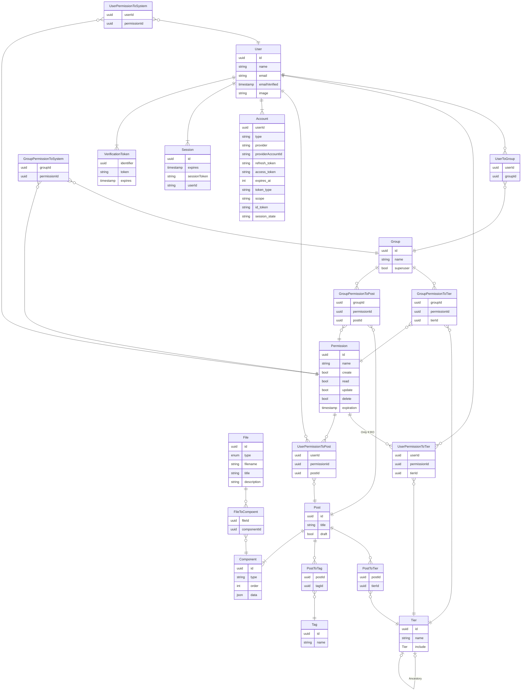

```mermaid
erDiagram
  Post {
    uuid id
    string title
    bool draft
  }

  PostToTier {
    uuid postId
    uuid tierId
  }

  Post ||--o{ PostToTier : ""
  PostToTier }o--|| Tier : "" 

  Tier {
    uuid id
    string name
    Tier include
  }

  Tag {
    uuid id
    string name
  }

  PostToTag {
    uuid postId
    uuid tagId
  }

  Post ||--o{ PostToTag : ""
  PostToTag }o--|| Tag : ""

  Component {
    uuid id
    string type
    int order
    json data
  }

  FileToCompoent {
    uuid fileId
    uuid componentId
  }

  File {
    uuid id
    enum type
    string filename
    string title
    string description
  }

  File ||--o{ FileToCompoent : ""
  FileToCompoent }o--|| Component : ""
  
  Tier |o--o| Tier : "Ancestory"
  Post ||--|{ Component : ""

  User {
    uuid id
    string name
    string email
    timestamp emailVerified
    string image
  }

  Group {
    uuid id
    string name
    bool superuser
  }

  UserToGroup {
    uuid userId
    uuid groupId
  }

  User ||--o{ UserToGroup : ""
  UserToGroup }o--|| Group  : ""

  Permission {
    uuid id
    string name
    bool create
    bool read
    boot update
    bool delete 
    timestamp expiration
  }

  UserPermissionToTier {
    uuid userId
    uuid permissionId
    uuid tierId
  }

  UserPermissionToPost {
    uuid userId
    uuid permissionId
    uuid postId
  }

  GroupPermissionToTier {
    uuid groupId
    uuid permissionId
    uuid tierId
  }

  GroupPermissionToPost {
    uuid groupId
    uuid permissionId
    uuid postId
  }

  UserPermissionToSystem {
    uuid userId
    uuid permissionId
  }

  GroupPermissionToSystem {
    uuid groupId
    uuid permissionId
  }

  UserPermissionToSystem }o--|| User : ""
  GroupPermissionToSystem }o--|| Group : ""

  UserPermissionToSystem }o--|| Permission : ""
  GroupPermissionToSystem }o--|| Permission : ""

  Permission ||--o{ UserPermissionToTier : "Only if RO"
  UserPermissionToTier }o--|| Tier : ""

  Permission ||--o{ UserPermissionToPost : ""
  UserPermissionToPost }o--|| Post : ""

  Group ||--o{ GroupPermissionToTier : ""
  Group ||--o{ GroupPermissionToPost : ""

  GroupPermissionToTier }o--|| Tier : ""
  GroupPermissionToPost }o--|| Post : ""

  GroupPermissionToTier }o--|| Permission : ""
  GroupPermissionToPost }o--|| Permission : ""

  User ||--o{ UserPermissionToTier : ""
  User ||--o{ UserPermissionToPost : ""

  User ||--|{ Account : ""


  User ||--|{ Session : ""

  Session {
    uuid id
    timestamp expires
    string sessionToken
    string userId
  }

  Account {
    uuid userId
    string type
    string provider
    string providerAccountId
    string refresh_token
    string access_token
    int expires_at
    string token_type
    string scope
    string id_token
    string session_state
  }

  User ||--|{ VerificationToken : ""

  VerificationToken {
    uuid identifier
    string token
    timestamp expires
  }
```